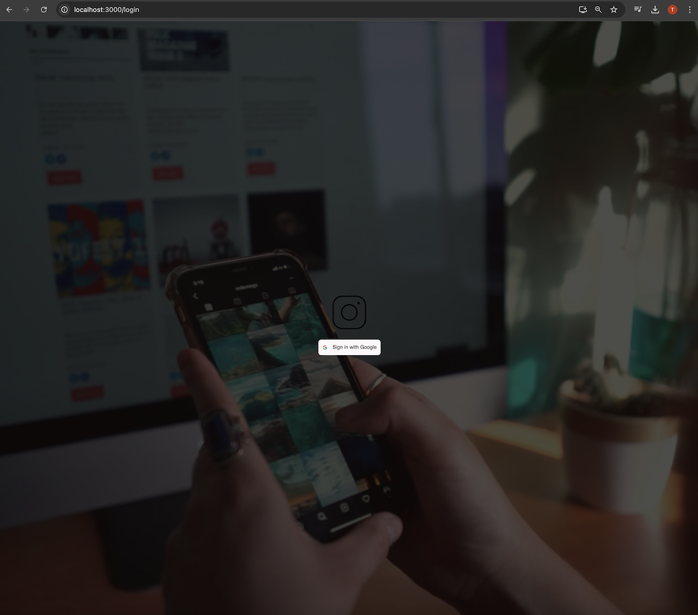
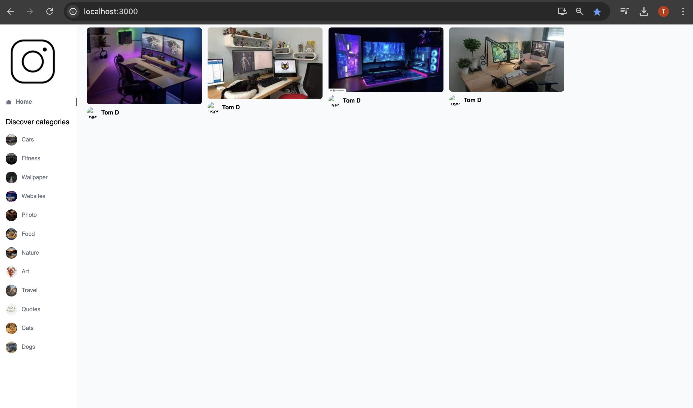
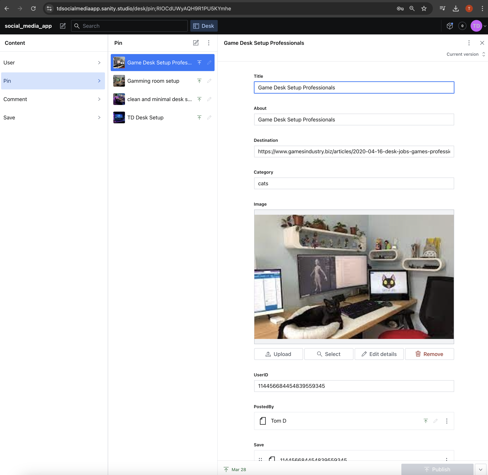
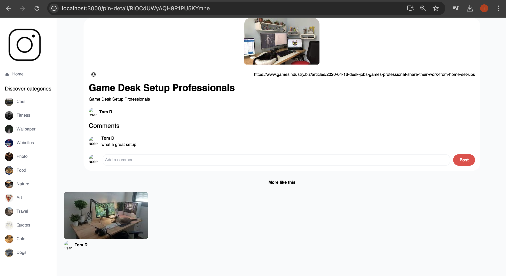
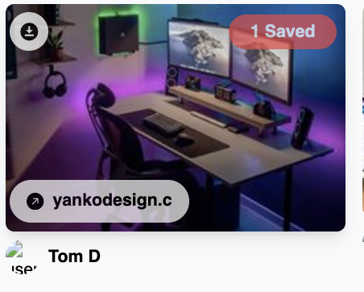

# social_media_app
Live demo: https://tdsocialmediaapp.netlify.app/

- Install [Node](https://nodejs.org/en/download/)
- Install [Git](https://git-scm.com/book/en/v2/Getting-Started-Installing-Git)
- Clone the repository `git clone https://github.com/tddag/social_media_app`
- Install server dependencies `cd backend && npm install`
- Install client dependencies `cd frontend && npm install`
- Setup [Sanity](https://www.sanity.io/)
- Setup [Google OAuth Client](https://console.cloud.google.com/auth/clients/)
- Setup client environment variables (./frontend/.env):
    <table>
        <tr>
            <th>Variable</th>
            <th>Value</th>
            <th>Description</th>
        </tr>
        <tr>
            <td>REACT_APP_GOOGLE_OAUTH_CLIENT_ID</td>
            <td>630587915727-s0.........apps.googleusercontent.com</td>
            <td>Google API Token</td>
        </tr>   
        <tr>
            <td>REACT_APP_SANITY_PROJECT_ID</td>
            <td>p223q..</td>
            <td>Sanity Project ID</td>
        </tr>   
        <tr>
            <td>REACT_APP_SANITY_TOKEN</td>
            <td>skt4tiizJKLpd....</td>
            <td>Sanity Token</td>
        </tr>            
                                              
    </table>
- Start the server: `cd backend && npm run start`
- Start the client: `cd frontend && npm run start`

# Functionalities
- Google Authentication
    <table>
        <tr>
            <td></td>
        </tr>
    </table>
- Pin Listing, Filter by Catagory
    <table>
        <tr>
            <td></td>
            <td></td>            
        </tr>
    </table>
- Pin Details, Post a Comment
    <table>
        <tr>
            <td></td>
        </tr>
    </table>
- Dowload Pin, Save Pin, Open Source Link
    <table>
        <tr>
            <td></td>
        </tr>
    </table>

# Technologies/Libraries
- Sanity: headless CMS (Content Management System)
- React: Web library
- Styled Components: CSS styling
- TailwindCSS: CSS framework
- postcss: Transforming styles with JS plugins
